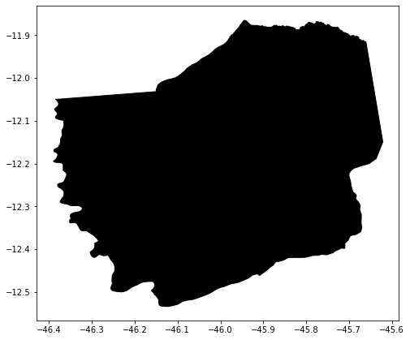
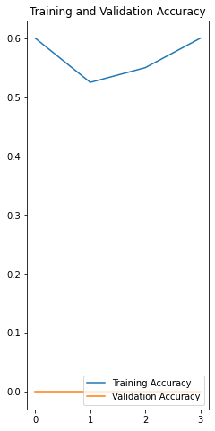

# Python Convolutional Neural Networks

[](https://docs.conda.io/en/latest/miniconda.html)
[](https://www.python.org/)
[](https://www.tensorflow.org/)
[](https://jupyter.org/)

O sistema deve reconhecer áreas de talhões (unidade mínima de cultivo de uma propriedade) em um mapa, utilizando dados multitemporais, através de inteligência artificial, a interface gráfica (Web GIS), deve permitir ao usuário selecionar um intervalo de tempo e as imagens de um catálogo disponível para a região selecionada, carregando-as em bloco para não sobrecarregar o sistema e ter opção para download.

Web GIS (Web Geographic Information System): Portal de um “Sistema de Informação Geográfica” (SIG), baseado em padrão de serviços web OGC, fornecendo uma estrutura para visualização e navegação de mapas (basemaps) e de dados geográficos vetoriais e matriciais.

- Catálogo de Imagem: O Catálogo de Imagem deve possibilitar a catalogação de coleções de dados espaço-temporal, (metadados) dos satélites Landsat 8 e Sentinel-2. Obs: O catálogo de imagem também deverá fornecer interface (web API) que permitirá consultar e recuperar as cenas de satélite catalogadas. Esta interface possibilitará que o Web GIS realize pesquisas complexas, filtrando diferentes parâmetros e especificando critérios geográficos.

- Map Tile Engine: Esse componente deve produzir “map raster tile” para uma determinada cena de satélite, obedecendo ao padrão OGC WMTS. Permitindo que
usuários do Web GIS visualizem e naveguem pelas imagens sem precisar baixá-las (real time streaming). Cada map tile é uma representação visual de parte da imagem, não dos dados em si. Esses tiles geralmente são renderizados em formato pictórico (PNG ou JPEG) que podem ser exibidos em uma aplicação web.

- Download: Após a consulta às imagens de uma determinada área de interesse, o sistema permite o download de todas as cenas (com todas as suas bandas) do período selecionado pelo usuário (Pilha de imagem).

- Máscara (Mask): Neste módulo, o sistema gerará uma máscara binária com as regiões de interesse (AOI’s) para cada cena selecionada. A construção das máscaras de saída das áreas de interesse, se dão apresentando valor igual a um (1) dentro desse poligono, enquanto as demais áreas (áreas não selecionadas) apresentam valor igual a zero (0).


<p align = "center">
  
</p>

- Arquivo: Após a geração da máscara para cada cena (scene), é preciso armazená-la tanto para validação visual quanto para download. Com isso, nesse módulo a máscara deve ser armazenada de alguma forma que possibilite ao usuário fazer sua validação visual (próxima etapa), assim como o download para treinamento de modelos de inteligência artificial.

> Funcionamento das redes neurais convolucionais para o processamento das imagens.

**Obs.:** Instalação do Miniconda é necessária para a execução dos comandos a seguir.

## Ambiente de Desenvolvimento
```
# Montar no ambiente Linux
$ sudo apt-get update
$ sudo apt-get install python-numpy gdal-bin libgdal-dev

# Crie um novo ambiente conda com Python3+
$ conda create --name python-cnn python=3.6.9

# Ativar o ambiente
$ conda activate python-cnn

# Com o ambiente ativado instalar o ipykernel
(python-cnn) $ conda install notebook ipykernel

# Com o ipykernel criar um kernel com o python 3.5 automático
(python-cnn) $ ipython kernel install --user --name python-cnn

# Instalar o servidor Jupyter Lab
(python-cnn) $ python -m pip install jupyter

# Instalar a biblioteca gdal e basemap para processar as imagens
(python-cnn) $ conda install -c conda-forge gdal=2.4.4 decartes

# Executar o servidor em modo de desenvolvimento
(python-cnn) $ jupyter notebook
```

> **Obs.:** Pode ser que o Notebook não  reconheça o kernel instalado pelo conda, sendo assim você pode alterar manualmente `kernel >> Change Kernel >> python-cnn`.

## Ambiente de micro serviços em docker
```
# Construir a imagem Docker
$ docker build -t jupyter-python-cnn .

# Executar a imagem
$ docker run --name jupyter-python-cnn-docker -p 8890:8888 -d jupyter-python-cnn
```

## Código fonte

> Também será necessário acesso ao servidores FTP:

- [Sentinel-1 Data](http://www.dpi.inpe.br/agricultural-database/lem/dados/cenas/Sentinel1);

- [Sentinel-2 Data](http://www.dpi.inpe.br/obt/agricultural-database/lem/dados/cenas/Sentinel2);

- [Landsat-8 Data](http://www.dpi.inpe.br/obt/agricultural-database/lem/dados/cenas/Landsat8);

> Para a execução do código fonte abaixo é necessário o download da pasta [`data/`](https://fatecspgov-my.sharepoint.com/:u:/g/personal/abner_anjos_fatec_sp_gov_br/EaRDNhpRDGJMmSXc-AtoTDgBkG3G5tGBPvsdJBkeEOMSNw?e=fzM3V9), após o download descompacte na pasta root do projeto.


```
data/
    |_ input/
        |_ train/
            |_ false/
            |_ true/
        |_ validation/
            |_ br_uf/
            |_ false/
            |_ LEM_shapes/
            |_ true/
    |_ output/
```


```python
# !pip install tensorflow numpy matplotlib pillow wget rasterio geopandas
```


```python
import os
```


```python
import tensorflow as tf
```


```python
from tensorflow.keras.models import Sequential
from tensorflow.keras.layers import Dense, Conv2D, Flatten, Dropout, MaxPooling2D
from tensorflow.keras.preprocessing.image import ImageDataGenerator

import numpy as np
import matplotlib.pyplot as plt
```


```python
# Abstração das buscas por polígonos e georasters
from services.georasters import Georaster
from services.vector import Vector
```


```python
data = Georaster('2017-06-12 08h:35m:46s','vh', 4326)
```


```python
data.openRemoteFile()
```


    True


```python
data.projection
```


    'EPSG:4326'


```python
data.downloadRemoteFile()
```


    True


```python
data.convertFileToJPG()
```


    True


```python
data.georaster.read(1)
```


    array([[nan, nan, nan, ..., nan, nan, nan],
           [nan, nan, nan, ..., nan, nan, nan],
           [nan, nan, nan, ..., nan, nan, nan],
           ...,
           [nan, nan, nan, ..., nan, nan, nan],
           [nan, nan, nan, ..., nan, nan, nan],
           [nan, nan, nan, ..., nan, nan, nan]], dtype=float32)


```python
data.jpg
```


<p align = "center">
  
</p>


```python
for coords in data.geom.get('coordinates'):
    for coord in coords:
        print(data.georaster.read(1)[int(coord[1])][int(coord[0])])
```

    -18.735785
    -19.409836
    -20.503849
    -17.980326
    -18.735785


```python
shapes = Vector(4326)
```


```python
data.geom
```


    {'type': 'Polygon',
     'coordinates': [[[-46.422421, -11.831513],
       [-46.426524, -12.598503],
       [-45.629512, -12.601568],
       [-45.627701, -11.834385],
       [-46.422421, -11.831513]]]}


```python
data_geom = shapes.shape(data.geom.get('coordinates')[0])
data_geom
```


<p align = "left">
  
</p>


```python
data.geom
```


    {'type': 'Polygon',
     'coordinates': [[[-46.422421, -11.831513],
       [-46.426524, -12.598503],
       [-45.629512, -12.601568],
       [-45.627701, -11.834385],
       [-46.422421, -11.831513]]]}


```python
shapes.lem.head(5)
```


<div>
<style scoped>
    .dataframe tbody tr th:only-of-type {
        vertical-align: middle;
    }

    .dataframe tbody tr th {
        vertical-align: top;
    }

    .dataframe thead th {
        text-align: right;
    }
</style>
<table border="1" class="dataframe">
  <thead>
    <tr style="text-align: right;">
      <th></th>
      <th>NM_MUNICIP</th>
      <th>CD_GEOCMU</th>
      <th>geometry</th>
    </tr>
  </thead>
  <tbody>
    <tr>
      <th>0</th>
      <td>LUÍS EDUARDO MAGALHÃES</td>
      <td>2919553</td>
      <td>POLYGON ((-45.71038 -12.39706, -45.71422 -12.3...</td>
    </tr>
  </tbody>
</table>
</div>


```python
shapes.covers.head(5)
```


<div>
<style scoped>
    .dataframe tbody tr th:only-of-type {
        vertical-align: middle;
    }

    .dataframe tbody tr th {
        vertical-align: top;
    }

    .dataframe thead th {
        text-align: right;
    }
</style>
<table border="1" class="dataframe">
  <thead>
    <tr style="text-align: right;">
      <th></th>
      <th>Id</th>
      <th>area_ha</th>
      <th>Jun_2017</th>
      <th>Jul_2017</th>
      <th>Aug_2017</th>
      <th>Sep_2017</th>
      <th>Oct_2017</th>
      <th>Nov_2017</th>
      <th>Dec_2017</th>
      <th>Jan_2018</th>
      <th>Feb_2018</th>
      <th>Mar_2018</th>
      <th>Apr_2018</th>
      <th>May_2018</th>
      <th>Jun_2018</th>
      <th>Geral</th>
      <th>variacao</th>
      <th>var</th>
      <th>geometry</th>
    </tr>
  </thead>
  <tbody>
    <tr>
      <th>0</th>
      <td>1</td>
      <td>341.632515</td>
      <td>uncultivated soil</td>
      <td>uncultivated soil</td>
      <td>uncultivated soil</td>
      <td>uncultivated soil</td>
      <td>uncultivated soil</td>
      <td>uncultivated soil</td>
      <td>uncultivated soil</td>
      <td>soybean</td>
      <td>soybean</td>
      <td>soybean</td>
      <td>uncultivated soil</td>
      <td>uncultivated soil</td>
      <td>uncultivated soil</td>
      <td>xxxxxxxsssxxx</td>
      <td>xsx</td>
      <td>s</td>
      <td>POLYGON ((391870.392 8678209.011, 390327.395 8...</td>
    </tr>
    <tr>
      <th>1</th>
      <td>523</td>
      <td>148.290258</td>
      <td>millet</td>
      <td>millet</td>
      <td>uncultivated soil</td>
      <td>uncultivated soil</td>
      <td>uncultivated soil</td>
      <td>not identified</td>
      <td>uncultivated soil</td>
      <td>not identified</td>
      <td>not identified</td>
      <td>uncultivated soil</td>
      <td>millet</td>
      <td>millet</td>
      <td>uncultivated soil</td>
      <td>llxxx-x--xllx</td>
      <td>lxlx</td>
      <td>ll</td>
      <td>POLYGON ((362953.448 8648254.537, 362492.885 8...</td>
    </tr>
    <tr>
      <th>2</th>
      <td>3</td>
      <td>196.784309</td>
      <td>uncultivated soil</td>
      <td>uncultivated soil</td>
      <td>uncultivated soil</td>
      <td>uncultivated soil</td>
      <td>uncultivated soil</td>
      <td>uncultivated soil</td>
      <td>uncultivated soil</td>
      <td>soybean</td>
      <td>soybean</td>
      <td>soybean</td>
      <td>uncultivated soil</td>
      <td>uncultivated soil</td>
      <td>uncultivated soil</td>
      <td>xxxxxxxsssxxx</td>
      <td>xsx</td>
      <td>s</td>
      <td>POLYGON ((394667.970 8677930.309, 394381.632 8...</td>
    </tr>
    <tr>
      <th>3</th>
      <td>524</td>
      <td>28.625248</td>
      <td>sorghum</td>
      <td>sorghum</td>
      <td>sorghum</td>
      <td>uncultivated soil</td>
      <td>uncultivated soil</td>
      <td>uncultivated soil</td>
      <td>uncultivated soil</td>
      <td>soybean</td>
      <td>soybean</td>
      <td>soybean</td>
      <td>uncultivated soil</td>
      <td>uncultivated soil</td>
      <td>uncultivated soil</td>
      <td>zzzxxxxsssxxx</td>
      <td>zxsx</td>
      <td>zs</td>
      <td>POLYGON ((378784.772 8650768.854, 378340.528 8...</td>
    </tr>
    <tr>
      <th>4</th>
      <td>6</td>
      <td>369.452478</td>
      <td>uncultivated soil</td>
      <td>uncultivated soil</td>
      <td>uncultivated soil</td>
      <td>uncultivated soil</td>
      <td>uncultivated soil</td>
      <td>uncultivated soil</td>
      <td>uncultivated soil</td>
      <td>uncultivated soil</td>
      <td>soybean</td>
      <td>soybean</td>
      <td>uncultivated soil</td>
      <td>uncultivated soil</td>
      <td>uncultivated soil</td>
      <td>xxxxxxxxssxxx</td>
      <td>xsx</td>
      <td>s</td>
      <td>POLYGON ((398795.097 8680743.662, 398796.144 8...</td>
    </tr>
  </tbody>
</table>
</div>


```python
shapes.lem.plot(color = 'black', edgecolor = 'black', figsize = (8, 8))
```


    <matplotlib.axes._subplots.AxesSubplot at 0x7f7440b11a20>


<p align = "center">
  
</p>


```python
shapes.covers.plot(color = 'white', edgecolor = 'black', figsize = (8, 8))
```


    <matplotlib.axes._subplots.AxesSubplot at 0x7f7440ab0438>


<p align = "center">
  
</p>


```python
!ls -l data/input/train/true
```

    total 1751248
    -rw-r--r-- 1 guilherme guilherme    297819 Jun 12 20:30 image10.jpg
    -rw-r--r-- 1 guilherme guilherme      1194 Jun 12 20:30 image10.jpg.aux.xml
    -rw-r--r-- 1 guilherme guilherme 117589085 Jun  4  2018 image10.tif
    -rw-r--r-- 1 guilherme guilherme   7300659 Jun 12 20:30 image11.jpg
    -rw-r--r-- 1 guilherme guilherme      1206 Jun 12 20:30 image11.jpg.aux.xml
    -rw-r--r-- 1 guilherme guilherme  58825766 Jun  4  2018 image11.tif
    -rw-r--r-- 1 guilherme guilherme   8297339 Jun 12 20:30 image1.jpg
    -rw-r--r-- 1 guilherme guilherme      1089 Jun 12 20:30 image1.jpg.aux.xml
    -rw-r--r-- 1 guilherme guilherme 228341788 May 14 11:18 image1.tif
    -rw-r--r-- 1 guilherme guilherme   8064213 Jun 12 20:30 image2.jpg
    -rw-r--r-- 1 guilherme guilherme      1089 Jun 12 20:30 image2.jpg.aux.xml
    -rw-rw-r-- 1 guilherme guilherme 231710599 May 27 07:59 image2.tif
    -rw-r--r-- 1 guilherme guilherme   9966359 Jun 12 20:30 image3.jpg
    -rw-r--r-- 1 guilherme guilherme      1089 Jun 12 20:30 image3.jpg.aux.xml
    -rw-r--r-- 1 guilherme guilherme 228918854 May 11 17:15 image3.tif
    -rw-r--r-- 1 guilherme guilherme   7532849 Jun 12 20:30 image4.jpg
    -rw-r--r-- 1 guilherme guilherme      1089 Jun 12 20:30 image4.jpg.aux.xml
    -rw-rw-r-- 1 guilherme guilherme 231557786 May 11 10:27 image4.tif
    -rw-r--r-- 1 guilherme guilherme   7530780 Jun 12 20:30 image5.jpg
    -rw-r--r-- 1 guilherme guilherme      1089 Jun 12 20:30 image5.jpg.aux.xml
    -rw-rw-r-- 1 guilherme guilherme 228275958 May 11 10:27 image5.tif
    -rw-r--r-- 1 guilherme guilherme    295697 Jun 12 20:30 image6.jpg
    -rw-r--r-- 1 guilherme guilherme      1194 Jun 12 20:30 image6.jpg.aux.xml
    -rw-r--r-- 1 guilherme guilherme 117743705 Jun  4  2018 image6.tif
    -rw-r--r-- 1 guilherme guilherme    274931 Jun 12 20:30 image7.jpg
    -rw-r--r-- 1 guilherme guilherme      1172 Jun 12 20:30 image7.jpg.aux.xml
    -rw-r--r-- 1 guilherme guilherme 117743683 Jun  4  2018 image7.tif
    -rw-r--r-- 1 guilherme guilherme   6144049 Jun 12 20:30 image8.jpg
    -rw-r--r-- 1 guilherme guilherme      1206 Jun 12 20:30 image8.jpg.aux.xml
    -rw-r--r-- 1 guilherme guilherme  58903076 Jun  4  2018 image8.tif
    -rw-r--r-- 1 guilherme guilherme    273717 Jun 12 20:30 image9.jpg
    -rw-r--r-- 1 guilherme guilherme      1172 Jun 12 20:30 image9.jpg.aux.xml
    -rw-r--r-- 1 guilherme guilherme 117589063 Jun  4  2018 image9.tif


```python
for i in range(11):
    if data.convertAnyFileToJPG("data/input/train/true/image{}".format(i + 1)):
        print("Converted Image {}".format(i + 1))
```

    Converted Image 1
    Converted Image 2
    Converted Image 3
    Converted Image 4
    Converted Image 5
    Converted Image 6
    Converted Image 7
    Converted Image 8
    Converted Image 9
    Converted Image 10
    Converted Image 11


```python
!ls -l data/input/train/false
```

    total 1651376
    -rw-r--r-- 1 guilherme guilherme   2871689 Jun 12 20:31 image10.jpg
    -rw-r--r-- 1 guilherme guilherme      1195 Jun 12 20:31 image10.jpg.aux.xml
    -rw-r--r-- 1 guilherme guilherme 117589091 Jun  4  2018 image10.tif
    -rw-r--r-- 1 guilherme guilherme   3782439 Jun 12 20:31 image11.jpg
    -rw-r--r-- 1 guilherme guilherme      1195 Jun 12 20:31 image11.jpg.aux.xml
    -rw-r--r-- 1 guilherme guilherme 117589091 Jun  4  2018 image11.tif
    -rw-r--r-- 1 guilherme guilherme   4025493 Jun 12 20:31 image12.jpg
    -rw-r--r-- 1 guilherme guilherme      1195 Jun 12 20:31 image12.jpg.aux.xml
    -rw-r--r-- 1 guilherme guilherme 117589091 Jun  4  2018 image12.tif
    -rw-r--r-- 1 guilherme guilherme   5155462 Jun 12 20:31 image13.jpg
    -rw-r--r-- 1 guilherme guilherme      1195 Jun 12 20:31 image13.jpg.aux.xml
    -rw-r--r-- 1 guilherme guilherme 117589091 Jun  4  2018 image13.tif
    -rw-r--r-- 1 guilherme guilherme   2997222 Jun 12 20:31 image14.jpg
    -rw-r--r-- 1 guilherme guilherme      1195 Jun 12 20:31 image14.jpg.aux.xml
    -rw-r--r-- 1 guilherme guilherme 117589091 Jun  4  2018 image14.tif
    -rw-r--r-- 1 guilherme guilherme   1965034 Jun 12 20:30 image1.jpg
    -rw-r--r-- 1 guilherme guilherme      1195 Jun 12 20:30 image1.jpg.aux.xml
    -rw-r--r-- 1 guilherme guilherme 117743711 Jun  4  2018 image1.tif
    -rw-r--r-- 1 guilherme guilherme   2143385 Jun 12 20:30 image2.jpg
    -rw-r--r-- 1 guilherme guilherme      1195 Jun 12 20:30 image2.jpg.aux.xml
    -rw-r--r-- 1 guilherme guilherme 117743711 Jun  4  2018 image2.tif
    -rw-r--r-- 1 guilherme guilherme   2847540 Jun 12 20:31 image3.jpg
    -rw-r--r-- 1 guilherme guilherme      1195 Jun 12 20:31 image3.jpg.aux.xml
    -rw-r--r-- 1 guilherme guilherme 117743711 Jun  4  2018 image3.tif
    -rw-r--r-- 1 guilherme guilherme   3999678 Jun 12 20:31 image4.jpg
    -rw-r--r-- 1 guilherme guilherme      1195 Jun 12 20:31 image4.jpg.aux.xml
    -rw-r--r-- 1 guilherme guilherme 117743711 Jun  4  2018 image4.tif
    -rw-r--r-- 1 guilherme guilherme   4058218 Jun 12 20:31 image5.jpg
    -rw-r--r-- 1 guilherme guilherme      1195 Jun 12 20:31 image5.jpg.aux.xml
    -rw-r--r-- 1 guilherme guilherme 117743711 Jun  4  2018 image5.tif
    -rw-r--r-- 1 guilherme guilherme   2764875 Jun 12 20:31 image6.jpg
    -rw-r--r-- 1 guilherme guilherme      1195 Jun 12 20:31 image6.jpg.aux.xml
    -rw-r--r-- 1 guilherme guilherme 117743711 Jun  4  2018 image6.tif
    -rw-r--r-- 1 guilherme guilherme   2331207 Jun 12 20:31 image7.jpg
    -rw-r--r-- 1 guilherme guilherme      1195 Jun 12 20:31 image7.jpg.aux.xml
    -rw-r--r-- 1 guilherme guilherme 117743711 Jun  4  2018 image7.tif
    -rw-r--r-- 1 guilherme guilherme   2215435 Jun 12 20:31 image8.jpg
    -rw-r--r-- 1 guilherme guilherme      1195 Jun 12 20:31 image8.jpg.aux.xml
    -rw-r--r-- 1 guilherme guilherme 117589091 Jun  4  2018 image8.tif
    -rw-r--r-- 1 guilherme guilherme   2387198 Jun 12 20:31 image9.jpg
    -rw-r--r-- 1 guilherme guilherme      1195 Jun 12 20:31 image9.jpg.aux.xml
    -rw-r--r-- 1 guilherme guilherme 117589091 Jun  4  2018 image9.tif


```python
for i in range(14):
    if data.convertAnyFileToJPG("data/input/train/false/image{}".format(i + 1)):
        print("Converted Image {}".format(i + 1))
```

    Converted Image 1
    Converted Image 2
    Converted Image 3
    Converted Image 4
    Converted Image 5
    Converted Image 6
    Converted Image 7
    Converted Image 8
    Converted Image 9
    Converted Image 10
    Converted Image 11
    Converted Image 12
    Converted Image 13
    Converted Image 14


```python
!ls -Rl data/input/train
```

    data/input/train:
    total 1353008
    -rw-r--r-- 1 guilherme guilherme 228341788 Jun 12 21:04 'clip_20170612T083546_Sigma0_VH_db (1).tif'
    -rw-r--r-- 1 guilherme guilherme   8297339 Jun 12 21:04  clip_20170612T083546_Sigma0_VH_db.jpg
    -rw-r--r-- 1 guilherme guilherme      1089 Jun 12 21:04  clip_20170612T083546_Sigma0_VH_db.jpg.aux.xml
    -rw-r--r-- 1 guilherme guilherme 228341788 May 14 11:18  clip_20170612T083546_Sigma0_VH_db.tif
    -rw-rw-r-- 1 guilherme guilherme 231710599 May 27 07:59  clip_20170612T083546_Sigma0_VV_db.tif
    -rw-rw-r-- 1 guilherme guilherme 228275958 May 11 10:27  clip_20170624T083547_Sigma0_VH_db.tif
    -rw-rw-r-- 1 guilherme guilherme 231557786 May 11 10:27  clip_20170624T083547_Sigma0_VV_db.tif
    -rw-r--r-- 1 guilherme guilherme 228918854 May 11 17:15  clip_20180315T083548_Sigma0_VH_db.tif
    drwxr-xr-x 2 guilherme guilherme      4096 Jun 12 21:06  false
    drwxr-xr-x 2 guilherme guilherme      4096 Jun 12 21:05  true

    data/input/train/false:
    total 1651376
    -rw-r--r-- 1 guilherme guilherme   2871689 Jun 12 21:06 image10.jpg
    -rw-r--r-- 1 guilherme guilherme      1195 Jun 12 21:06 image10.jpg.aux.xml
    -rw-r--r-- 1 guilherme guilherme 117589091 Jun  4  2018 image10.tif
    -rw-r--r-- 1 guilherme guilherme   3782439 Jun 12 21:06 image11.jpg
    -rw-r--r-- 1 guilherme guilherme      1195 Jun 12 21:06 image11.jpg.aux.xml
    -rw-r--r-- 1 guilherme guilherme 117589091 Jun  4  2018 image11.tif
    -rw-r--r-- 1 guilherme guilherme   4025493 Jun 12 21:06 image12.jpg
    -rw-r--r-- 1 guilherme guilherme      1195 Jun 12 21:06 image12.jpg.aux.xml
    -rw-r--r-- 1 guilherme guilherme 117589091 Jun  4  2018 image12.tif
    -rw-r--r-- 1 guilherme guilherme   5155462 Jun 12 21:06 image13.jpg
    -rw-r--r-- 1 guilherme guilherme      1195 Jun 12 21:06 image13.jpg.aux.xml
    -rw-r--r-- 1 guilherme guilherme 117589091 Jun  4  2018 image13.tif
    -rw-r--r-- 1 guilherme guilherme   2997222 Jun 12 21:06 image14.jpg
    -rw-r--r-- 1 guilherme guilherme      1195 Jun 12 21:06 image14.jpg.aux.xml
    -rw-r--r-- 1 guilherme guilherme 117589091 Jun  4  2018 image14.tif
    -rw-r--r-- 1 guilherme guilherme   1965034 Jun 12 21:05 image1.jpg
    -rw-r--r-- 1 guilherme guilherme      1195 Jun 12 21:05 image1.jpg.aux.xml
    -rw-r--r-- 1 guilherme guilherme 117743711 Jun  4  2018 image1.tif
    -rw-r--r-- 1 guilherme guilherme   2143385 Jun 12 21:05 image2.jpg
    -rw-r--r-- 1 guilherme guilherme      1195 Jun 12 21:05 image2.jpg.aux.xml
    -rw-r--r-- 1 guilherme guilherme 117743711 Jun  4  2018 image2.tif
    -rw-r--r-- 1 guilherme guilherme   2847540 Jun 12 21:05 image3.jpg
    -rw-r--r-- 1 guilherme guilherme      1195 Jun 12 21:05 image3.jpg.aux.xml
    -rw-r--r-- 1 guilherme guilherme 117743711 Jun  4  2018 image3.tif
    -rw-r--r-- 1 guilherme guilherme   3999678 Jun 12 21:05 image4.jpg
    -rw-r--r-- 1 guilherme guilherme      1195 Jun 12 21:05 image4.jpg.aux.xml
    -rw-r--r-- 1 guilherme guilherme 117743711 Jun  4  2018 image4.tif
    -rw-r--r-- 1 guilherme guilherme   4058218 Jun 12 21:05 image5.jpg
    -rw-r--r-- 1 guilherme guilherme      1195 Jun 12 21:05 image5.jpg.aux.xml
    -rw-r--r-- 1 guilherme guilherme 117743711 Jun  4  2018 image5.tif
    -rw-r--r-- 1 guilherme guilherme   2764875 Jun 12 21:06 image6.jpg
    -rw-r--r-- 1 guilherme guilherme      1195 Jun 12 21:06 image6.jpg.aux.xml
    -rw-r--r-- 1 guilherme guilherme 117743711 Jun  4  2018 image6.tif
    -rw-r--r-- 1 guilherme guilherme   2331207 Jun 12 21:06 image7.jpg
    -rw-r--r-- 1 guilherme guilherme      1195 Jun 12 21:06 image7.jpg.aux.xml
    -rw-r--r-- 1 guilherme guilherme 117743711 Jun  4  2018 image7.tif
    -rw-r--r-- 1 guilherme guilherme   2215435 Jun 12 21:06 image8.jpg
    -rw-r--r-- 1 guilherme guilherme      1195 Jun 12 21:06 image8.jpg.aux.xml
    -rw-r--r-- 1 guilherme guilherme 117589091 Jun  4  2018 image8.tif
    -rw-r--r-- 1 guilherme guilherme   2387198 Jun 12 21:06 image9.jpg
    -rw-r--r-- 1 guilherme guilherme      1195 Jun 12 21:06 image9.jpg.aux.xml
    -rw-r--r-- 1 guilherme guilherme 117589091 Jun  4  2018 image9.tif

    data/input/train/true:
    total 1751248
    -rw-r--r-- 1 guilherme guilherme    297819 Jun 12 21:05 image10.jpg
    -rw-r--r-- 1 guilherme guilherme      1194 Jun 12 21:05 image10.jpg.aux.xml
    -rw-r--r-- 1 guilherme guilherme 117589085 Jun  4  2018 image10.tif
    -rw-r--r-- 1 guilherme guilherme   7300659 Jun 12 21:05 image11.jpg
    -rw-r--r-- 1 guilherme guilherme      1206 Jun 12 21:05 image11.jpg.aux.xml
    -rw-r--r-- 1 guilherme guilherme  58825766 Jun  4  2018 image11.tif
    -rw-r--r-- 1 guilherme guilherme   8297339 Jun 12 21:04 image1.jpg
    -rw-r--r-- 1 guilherme guilherme      1089 Jun 12 21:04 image1.jpg.aux.xml
    -rw-r--r-- 1 guilherme guilherme 228341788 May 14 11:18 image1.tif
    -rw-r--r-- 1 guilherme guilherme   8064213 Jun 12 21:05 image2.jpg
    -rw-r--r-- 1 guilherme guilherme      1089 Jun 12 21:05 image2.jpg.aux.xml
    -rw-rw-r-- 1 guilherme guilherme 231710599 May 27 07:59 image2.tif
    -rw-r--r-- 1 guilherme guilherme   9966359 Jun 12 21:05 image3.jpg
    -rw-r--r-- 1 guilherme guilherme      1089 Jun 12 21:05 image3.jpg.aux.xml
    -rw-r--r-- 1 guilherme guilherme 228918854 May 11 17:15 image3.tif
    -rw-r--r-- 1 guilherme guilherme   7532849 Jun 12 21:05 image4.jpg
    -rw-r--r-- 1 guilherme guilherme      1089 Jun 12 21:05 image4.jpg.aux.xml
    -rw-rw-r-- 1 guilherme guilherme 231557786 May 11 10:27 image4.tif
    -rw-r--r-- 1 guilherme guilherme   7530780 Jun 12 21:05 image5.jpg
    -rw-r--r-- 1 guilherme guilherme      1089 Jun 12 21:05 image5.jpg.aux.xml
    -rw-rw-r-- 1 guilherme guilherme 228275958 May 11 10:27 image5.tif
    -rw-r--r-- 1 guilherme guilherme    295697 Jun 12 21:05 image6.jpg
    -rw-r--r-- 1 guilherme guilherme      1194 Jun 12 21:05 image6.jpg.aux.xml
    -rw-r--r-- 1 guilherme guilherme 117743705 Jun  4  2018 image6.tif
    -rw-r--r-- 1 guilherme guilherme    274931 Jun 12 21:05 image7.jpg
    -rw-r--r-- 1 guilherme guilherme      1172 Jun 12 21:05 image7.jpg.aux.xml
    -rw-r--r-- 1 guilherme guilherme 117743683 Jun  4  2018 image7.tif
    -rw-r--r-- 1 guilherme guilherme   6144049 Jun 12 21:05 image8.jpg
    -rw-r--r-- 1 guilherme guilherme      1206 Jun 12 21:05 image8.jpg.aux.xml
    -rw-r--r-- 1 guilherme guilherme  58903076 Jun  4  2018 image8.tif
    -rw-r--r-- 1 guilherme guilherme    273717 Jun 12 21:05 image9.jpg
    -rw-r--r-- 1 guilherme guilherme      1172 Jun 12 21:05 image9.jpg.aux.xml
    -rw-r--r-- 1 guilherme guilherme 117589063 Jun  4  2018 image9.tif


```python
!ls -l data/input/validation/true
```

    total 2104560
    -rw-r--r-- 1 guilherme guilherme   7871698 Jun 12 20:31 image1.jpg
    -rw-r--r-- 1 guilherme guilherme      1089 Jun 12 20:31 image1.jpg.aux.xml
    -rw-rw-r-- 1 guilherme guilherme 230180639 May 27 15:27 image1.tif
    -rw-r--r-- 1 guilherme guilherme   7862518 Jun 12 20:31 image2.jpg
    -rw-r--r-- 1 guilherme guilherme      1089 Jun 12 20:31 image2.jpg.aux.xml
    -rw-rw-r-- 1 guilherme guilherme 233288867 May 27 15:27 image2.tif
    -rw-r--r-- 1 guilherme guilherme   8185099 Jun 12 20:31 image3.jpg
    -rw-r--r-- 1 guilherme guilherme      1089 Jun 12 20:31 image3.jpg.aux.xml
    -rw-rw-r-- 1 guilherme guilherme 230717127 May 27 15:24 image3.tif
    -rw-r--r-- 1 guilherme guilherme   8318538 Jun 12 20:31 image4.jpg
    -rw-r--r-- 1 guilherme guilherme      1089 Jun 12 20:31 image4.jpg.aux.xml
    -rw-rw-r-- 1 guilherme guilherme 233672094 May 27 15:25 image4.tif
    -rw-r--r-- 1 guilherme guilherme  10049028 Jun 12 20:32 image5.jpg
    -rw-r--r-- 1 guilherme guilherme      1089 Jun 12 20:32 image5.jpg.aux.xml
    -rw-rw-r-- 1 guilherme guilherme 228496143 May 27 15:19 image5.tif
    -rw-r--r-- 1 guilherme guilherme  10357406 Jun 12 20:32 image6.jpg
    -rw-r--r-- 1 guilherme guilherme      1089 Jun 12 20:32 image6.jpg.aux.xml
    -rw-rw-r-- 1 guilherme guilherme 226850973 May 27 15:21 image6.tif
    -rw-r--r-- 1 guilherme guilherme   9850587 Jun 12 20:32 image7.jpg
    -rw-r--r-- 1 guilherme guilherme      1089 Jun 12 20:32 image7.jpg.aux.xml
    -rw-rw-r-- 1 guilherme guilherme 229910342 May 27 15:21 image7.tif
    -rw-r--r-- 1 guilherme guilherme  11412402 Jun 12 20:32 image8.jpg
    -rw-r--r-- 1 guilherme guilherme      1089 Jun 12 20:32 image8.jpg.aux.xml
    -rw-rw-r-- 1 guilherme guilherme 229693774 May 27 15:23 image8.tif
    -rw-r--r-- 1 guilherme guilherme  11925993 Jun 12 20:32 image9.jpg
    -rw-r--r-- 1 guilherme guilherme      1089 Jun 12 20:32 image9.jpg.aux.xml
    -rw-rw-r-- 1 guilherme guilherme 226351595 May 27 15:23 image9.tif


```python
for i in range(9):
    if data.convertAnyFileToJPG("data/input/validation/true/image{}".format(i + 1)):
        print("Converted Image {}".format(i + 1))
```

    Converted Image 1
    Converted Image 2
    Converted Image 3
    Converted Image 4
    Converted Image 5
    Converted Image 6
    Converted Image 7
    Converted Image 8
    Converted Image 9


```python
!ls -l data/input/validation/false
```

    total 1660528
    -rw-r--r-- 1 guilherme guilherme   3268609 Jun 12 20:33 image10.jpg
    -rw-r--r-- 1 guilherme guilherme      1195 Jun 12 20:33 image10.jpg.aux.xml
    -rw-r--r-- 1 guilherme guilherme 117589091 Jun  4  2018 image10.tif
    -rw-r--r-- 1 guilherme guilherme   3263234 Jun 12 20:33 image11.jpg
    -rw-r--r-- 1 guilherme guilherme      1195 Jun 12 20:33 image11.jpg.aux.xml
    -rw-r--r-- 1 guilherme guilherme 117589091 Jun  4  2018 image11.tif
    -rw-r--r-- 1 guilherme guilherme   3381101 Jun 12 20:33 image12.jpg
    -rw-r--r-- 1 guilherme guilherme      1195 Jun 12 20:33 image12.jpg.aux.xml
    -rw-r--r-- 1 guilherme guilherme 117589091 Jun  4  2018 image12.tif
    -rw-r--r-- 1 guilherme guilherme   4546254 Jun 12 20:33 image13.jpg
    -rw-r--r-- 1 guilherme guilherme      1195 Jun 12 20:33 image13.jpg.aux.xml
    -rw-r--r-- 1 guilherme guilherme 117589091 Jun  4  2018 image13.tif
    -rw-r--r-- 1 guilherme guilherme   4836100 Jun 12 20:33 image14.jpg
    -rw-r--r-- 1 guilherme guilherme      1195 Jun 12 20:33 image14.jpg.aux.xml
    -rw-r--r-- 1 guilherme guilherme 117589091 Jun  4  2018 image14.tif
    -rw-r--r-- 1 guilherme guilherme   3240131 Jun 12 20:32 image1.jpg
    -rw-r--r-- 1 guilherme guilherme      1195 Jun 12 20:32 image1.jpg.aux.xml
    -rw-r--r-- 1 guilherme guilherme 117743711 Jun  4  2018 image1.tif
    -rw-r--r-- 1 guilherme guilherme   3241932 Jun 12 20:32 image2.jpg
    -rw-r--r-- 1 guilherme guilherme      1195 Jun 12 20:32 image2.jpg.aux.xml
    -rw-r--r-- 1 guilherme guilherme 117743711 Jun  4  2018 image2.tif
    -rw-r--r-- 1 guilherme guilherme   3366261 Jun 12 20:32 image3.jpg
    -rw-r--r-- 1 guilherme guilherme      1195 Jun 12 20:32 image3.jpg.aux.xml
    -rw-r--r-- 1 guilherme guilherme 117743711 Jun  4  2018 image3.tif
    -rw-r--r-- 1 guilherme guilherme   3580752 Jun 12 20:32 image4.jpg
    -rw-r--r-- 1 guilherme guilherme      1195 Jun 12 20:32 image4.jpg.aux.xml
    -rw-r--r-- 1 guilherme guilherme 117743711 Jun  4  2018 image4.tif
    -rw-r--r-- 1 guilherme guilherme   4218408 Jun 12 20:32 image5.jpg
    -rw-r--r-- 1 guilherme guilherme      1195 Jun 12 20:32 image5.jpg.aux.xml
    -rw-r--r-- 1 guilherme guilherme 117743711 Jun  4  2018 image5.tif
    -rw-r--r-- 1 guilherme guilherme   4981837 Jun 12 20:32 image6.jpg
    -rw-r--r-- 1 guilherme guilherme      1195 Jun 12 20:32 image6.jpg.aux.xml
    -rw-r--r-- 1 guilherme guilherme 117743711 Jun  4  2018 image6.tif
    -rw-r--r-- 1 guilherme guilherme   4651111 Jun 12 20:32 image7.jpg
    -rw-r--r-- 1 guilherme guilherme      1195 Jun 12 20:32 image7.jpg.aux.xml
    -rw-r--r-- 1 guilherme guilherme 117743711 Jun  4  2018 image7.tif
    -rw-r--r-- 1 guilherme guilherme   3189797 Jun 12 20:33 image8.jpg
    -rw-r--r-- 1 guilherme guilherme      1195 Jun 12 20:33 image8.jpg.aux.xml
    -rw-r--r-- 1 guilherme guilherme 117589091 Jun  4  2018 image8.tif
    -rw-r--r-- 1 guilherme guilherme   3152223 Jun 12 20:33 image9.jpg
    -rw-r--r-- 1 guilherme guilherme      1195 Jun 12 20:33 image9.jpg.aux.xml
    -rw-r--r-- 1 guilherme guilherme 117589091 Jun  4  2018 image9.tif


```python
for i in range(14):
    if data.convertAnyFileToJPG("data/input/validation/false/image{}".format(i + 1)):
        print("Converted Image {}".format(i + 1))
```

    Converted Image 1
    Converted Image 2
    Converted Image 3
    Converted Image 4
    Converted Image 5
    Converted Image 6
    Converted Image 7
    Converted Image 8
    Converted Image 9
    Converted Image 10
    Converted Image 11
    Converted Image 12
    Converted Image 13
    Converted Image 14


```python
PATH = "data/input"
PATH
```


    'data/input'


```python
train_dir = os.path.join(PATH, 'train')
validation_dir = os.path.join(PATH, 'validation')
```


```python
train_false_dir = os.path.join(train_dir, 'false')
train_true_dir = os.path.join(train_dir, 'true')
validation_false_dir = os.path.join(validation_dir, 'false')
validation_true_dir = os.path.join(validation_dir, 'true')
```


```python
num_false_tr = len(os.listdir(train_false_dir))
num_true_tr = len(os.listdir(train_true_dir))

num_false_val = len(os.listdir(validation_false_dir))
num_true_val = len(os.listdir(validation_true_dir))

total_train = num_false_tr + num_true_tr
total_val = num_false_val + num_true_val
```


```python
print('total training false images:', num_false_tr)
print('total training true images:', num_true_tr)

print('total validation false images:', num_false_val)
print('total validation true images:', num_true_val)
print("--")
print("Total training images:", total_train)
print("Total validation images:", total_val)
```

    total training false images: 42
    total training true images: 33
    total validation false images: 42
    total validation true images: 27
    --
    Total training images: 75
    Total validation images: 69


```python
batch_size = 10
epochs = 4
IMG_HEIGHT = 150
IMG_WIDTH = 150
```


```python
# Generator for our training data
train_image_generator = ImageDataGenerator(
    rescale=1./255,
    horizontal_flip=True,  # Inverte a imagem
    zoom_range=0.4,  # Aplica zoom
    rotation_range=45,  # Rotaciona
    width_shift_range=.1,  # Estica horizontalmente a imagem
    height_shift_range=.11,  # Estica verticalmente a imagem
)
# Vale ressaltar que estas modificações nas imagens ocorrem durante as epochs
# e ajudam a evitar que o modelo tenha sido treinado com duas imagens iguais
# Então, teoricamente possuímos mais imagens de teste

# Generator for our validation data
validation_image_generator = ImageDataGenerator(rescale=1./255)
```


```python
train_data_gen = train_image_generator.flow_from_directory(
    batch_size=batch_size,
    directory=train_dir,
    shuffle=True,
    target_size=(IMG_HEIGHT, IMG_WIDTH),
    class_mode='binary'
)
```

    Found 50 images belonging to 2 classes.


```python
val_data_gen = validation_image_generator.flow_from_directory(
    batch_size=batch_size,
    directory=validation_dir,
    target_size=(IMG_HEIGHT, IMG_WIDTH),
    class_mode='binary'
)
```

    Found 46 images belonging to 4 classes.


```python
sample_training_images, _ = next(train_data_gen)
```


```python
# This function will plot images in the form of
# a grid with 1 row and 5 columns where images are placed in each column.
def plotImages(images_arr):
    fig, axes = plt.subplots(1, 5, figsize=(20,20))
    axes = axes.flatten()
    for img, ax in zip( images_arr, axes):
        ax.imshow(img)
        ax.axis('off')
    plt.tight_layout()
    plt.show()
```


```python
plotImages(sample_training_images[:5])
```


<p align = "center">
  
</p>


```python
augmented_images = [train_data_gen[0][0][1] for i in range(5)]
```


```python
plotImages(augmented_images)
```

<p align = "center">
  
</p>


```python
model = Sequential([
    Conv2D(16, 3, padding='same', activation='relu', input_shape=(IMG_HEIGHT, IMG_WIDTH ,3)),
    MaxPooling2D(),
    Dropout(0.2),
    Conv2D(32, 3, padding='same', activation='relu'),
    MaxPooling2D(),
    Dropout(0.1),
    Conv2D(64, 3, padding='same', activation='relu'),
    MaxPooling2D(),
    Dropout(0.1),
    Flatten(),
    Dense(512, activation='relu'),
    Dense(1)
])
```


```python
model.compile(
    optimizer='adam',
    loss=tf.keras.losses.BinaryCrossentropy(from_logits=True),
    metrics=['accuracy']
)
```


```python
model.summary()
```

    Model: "sequential"
    _________________________________________________________________
    Layer (type)                 Output Shape              Param #
    =================================================================
    conv2d (Conv2D)              (None, 150, 150, 16)      448
    _________________________________________________________________
    max_pooling2d (MaxPooling2D) (None, 75, 75, 16)        0
    _________________________________________________________________
    dropout (Dropout)            (None, 75, 75, 16)        0
    _________________________________________________________________
    conv2d_1 (Conv2D)            (None, 75, 75, 32)        4640
    _________________________________________________________________
    max_pooling2d_1 (MaxPooling2 (None, 37, 37, 32)        0
    _________________________________________________________________
    dropout_1 (Dropout)          (None, 37, 37, 32)        0
    _________________________________________________________________
    conv2d_2 (Conv2D)            (None, 37, 37, 64)        18496
    _________________________________________________________________
    max_pooling2d_2 (MaxPooling2 (None, 18, 18, 64)        0
    _________________________________________________________________
    dropout_2 (Dropout)          (None, 18, 18, 64)        0
    _________________________________________________________________
    flatten (Flatten)            (None, 20736)             0
    _________________________________________________________________
    dense (Dense)                (None, 512)               10617344
    _________________________________________________________________
    dense_1 (Dense)              (None, 1)                 513
    =================================================================
    Total params: 10,641,441
    Trainable params: 10,641,441
    Non-trainable params: 0
    _________________________________________________________________


```python
history = model.fit_generator(
    train_data_gen,
    steps_per_epoch=total_val // batch_size,  # total_train
    epochs=epochs,
    validation_data=val_data_gen,
    validation_steps=total_val // batch_size
)
```

    WARNING:tensorflow:From <ipython-input-48-bc7c196dd375>:6: Model.fit_generator (from tensorflow.python.keras.engine.training) is deprecated and will be removed in a future version.
    Instructions for updating:
    Please use Model.fit, which supports generators.
    Epoch 1/4
    4/4 [==============================] - 153s 38s/step - loss: 1.3653 - accuracy: 0.6000 - val_loss: 0.1966 - val_accuracy: 0.0000e+00
    Epoch 2/4
    4/4 [==============================] - 144s 36s/step - loss: 0.6799 - accuracy: 0.5250 - val_loss: 1.2178 - val_accuracy: 0.0000e+00
    Epoch 3/4
    4/4 [==============================] - 151s 38s/step - loss: 0.5490 - accuracy: 0.5500 - val_loss: 1.1076 - val_accuracy: 0.0000e+00
    Epoch 4/4
    4/4 [==============================] - 158s 40s/step - loss: 0.5802 - accuracy: 0.6000 - val_loss: 0.8831 - val_accuracy: 0.0000e+00


```python
acc = history.history['accuracy']
val_acc = history.history['val_accuracy']
loss=history.history['loss']
val_loss=history.history['val_loss']

```


```python
epochs_range = range(epochs)
```


```python
plt.figure(figsize=(8, 8))
plt.subplot(1, 2, 1)
plt.plot(epochs_range, acc, label='Training Accuracy')
plt.plot(epochs_range, val_acc, label='Validation Accuracy')
plt.legend(loc='lower right')
plt.title('Training and Validation Accuracy')

```


    Text(0.5, 1.0, 'Training and Validation Accuracy')


<p align = "center">
  
</p>


```python
plt.subplot(1, 2, 2)
plt.plot(epochs_range, loss, label='Training Loss')
plt.plot(epochs_range, val_loss, label='Validation Loss')
plt.legend(loc='upper right')
plt.title('Training and Validation Loss')
plt.show()

```

<p align = "center">
  
</p>


```python

```
