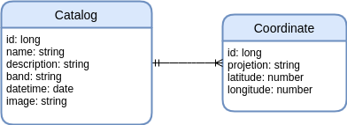

# API Spring Boot RESTful

[](https://www.java.com/)
[](https://spring.io/)
[](https://gradle.org/)
[](https://www.docker.com/)
[](https://www.postgresql.org/)
[](http://geoserver.org/)

<p align = "center">
  <iframe width="560" height="315" src="https://www.youtube.com/embed/LyoCLlyckVo" frameborder="0" allow="accelerometer; autoplay; encrypted-media; gyroscope; picture-in-picture" allowfullscreen></iframe>
</p>

Projeto Integrador entre o sexto período da Faculdade de Tecnologia de São José dos Campos, Professor Jessen Vidal de *Análise e Desenvolvimento de Sistemas* e a empresa [*Visiona*](http://www.visionaespacial.com.br/), para qual nos forneceu o problema da identificação de talhões em imagens de sensoriamento remoto.

Para o funcionamento da API Spring Boot com o catálogo de imagens, é necessário os seguintes requisitos:

- Uma instância do banco de dados [PostgreSQL/PostGIS](./db) em execução e configurado;
- Um servidor de mapas [Geoserver](./geoserver) em execução e configurado;

# Projeto

Este projeto consiste em:

1. Desenvolvimento de uma API RESTful para o catálogo de imagens georreferenciados em um banco de dados PostGIS;
2. Com dados multitemporais, utilizar-se de inteligência artificial para identificar talhões em uma área de interesse.

# Ferramentas

- CI

    É necessário uma máquina virtual, esta servirá para o software Jenkins que executará os processos de Integração Contínua.

    * Se a máquina for local, utilize o ngrok, um serviço gratuito de tunelamento sem configuração de firewall ou port forwarding.

    Agora no Jenkins deve-se configurar a *pipeline* de testes nos seguintes passos:

    1. *Clone*: Para buscar o repositório com os novos dados;
    2. *Environment*: Instala as dependências do projeto;
    3. *Testes*: Execução dos Testes JUnit.

    Configuar Webhook no GitHUB para o *endpoint* do Jenkins (*URL do ngrok se foi utilizado*) e ativar a opção:
    * GitHub hook trigger for GITScm polling

---

- CD

    `a definir processo de deploy.`

# Instalação e execução da aplicação

## Instalação para o ambiente de desenvolvimento
**Obs.:** Necessário instalação do [gradle 5+](https://gradle.org/).
```
$ gradle bootRun
```

## Execução da aplicação em micro serviços
**Obs.:** Não esqueça de mudar o endereço *`IP (localhost)`* do banco de dados no arquivo *[`application.properties`](./src/main/resources/application.properties)* para o endereço real do servidor PostgreSQL do seu computador.
```
## Gerar o arquivo executável `.jar` utilizando o Gradle 5
$ gradle build

## Construir a imagem docker com base no `Dockerfile`
$ docker build -t spring-restful .

## Executar o container localmente
$ docker run --name spring-api-restful -p 4040:8080 -d spring-restful
```

> O banco de dados criado por essa aplicação possui o seguinte modelo de relações:

<p align = "center">
  
</p>

> Após o comando `docker run` digite o seguinte `docker ps` para listar os serviços  em execução pelo seu docker instalado, a resposta deve ser a seguinte:

~~~shell
$ docker ps
CONTAINER ID        IMAGE                  COMMAND                  CREATED             STATUS              PORTS                              NAMES
20b1962dad83        spring-restful         "java -jar /app.jar"     3 minutes ago       Up 3 minutes        0.0.0.0:4040->8080/tcp             spring-api-restful
~~~

> Em seu navegador digite o seguinte link `localhost:4040/catalog/list`.

# Operações

> **Listagem:** lista todas as imagens cadastradas no banco de dados PostgreSQL por método GET:

```
GET localhost:4040/catalog/list
```
~~~json
{
  "features": [
    {
      "id": 1,
      "assets": [
        {
          "name": "VH",
          "href": "http://www.dpi.inpe.br/obt/agricultural-database/lem/dados/cenas/Sentinel1/20180408_S1A/clip_20180408T083549_Sigma0_VH_db.tif"
        }
      ],
      "bbox": [
        -45.8734130859375,
        -12.042006714207925,
        -45.7415771484375,
        -12.224602049269444
      ],
      "collection": "clip_20180408T083549_Sigma0_VH_db.tif",
      "geometry": {
        "type": "Polygon",
        "coordinates": [
          [
            [
              -12.042006714207925,
              -45.8734130859375
            ],
            [
              -12.224602049269444,
              -45.7415771484375
            ]
          ]
        ]
      },
      "properties": {
        "projection": "EPSG:4326",
        "band": "VH",
        "datetime": {
          "start": "2018-01-08T02:04:00.000+0000",
          "end": "2018-01-08T02:04:00.000+0000"
        }
      },
      "type": "sentinel A image clip_Sigma0_VH_db.tif INPE"
    }
  ],
  "numberMatched": 17,
  "numberReturned": 19,
  "type": "FeatureCollection"
}
~~~

> **Cadastro de imagens:** cadastra uma imagem com os atributos definidos nos [exemplos](https://github.com/ProjetoIntegradorADSFatec/api-restful/tree/master/docs/examples) no banco de dados PostgreSQL por método POST:

```
POST localhost:4040/catalog/add
```
~~~json
{
    "name": "clip_20170612T083546_Sigma0_VH_db",
    "description": "sentinel A image clip_Sigma0_VH_db.tif INPE",
    "band": "VH",
    "dateTime": "2017-06-12 08:35:46",
    "coordinates": [
        {
            "projection": "EPSG:4326",
            "latitude": -12.042006714207925,
            "longitude": -45.8734130859375
        },
        {
            "projection": "EPSG:4326",
            "latitude": -12.224602049269444,
            "longitude": -45.7415771484375
        }
	],
    "image": "http://www.dpi.inpe.br/agricultural-database/lem/dados/cenas/Sentinel1/20170612_S1A/clip_20170612T083546_Sigma0_VH_db.tif"
}
~~~

> **Busca de imagens:** busca imagens a partir de uma dado polígono formatado em [GeoJSON](https://geojson.org/) com os atributos definidos nos [exemplos](https://github.com/ProjetoIntegradorADSFatec/api-restful/tree/master/docs/examples) em projeção **EPSG:4326** com banco de dados PostgreSQL por método POST:

```
POST localhost:4040/catalog/search
```
~~~json
{
	"type": "FeatureCollection",
	"features": [
	  {
      "type": "Feature",
      "properties": {
        "dateTime": {
          "start": "2010-01-01",
          "end": "2017-12-31"
        },
        "band": "VV",
        "projection": "EPSG:4326"
      },
      "geometry": {
        "type": "Polygon",
        "coordinates": [[
          [
          -47.02148437499999,
          -10.790140750321738
          ],
          ...
        ]]
      }
    }
	]
}
~~~

> **Obs.:** Você pode aprender mais sobre GeoJSON's com o [geojson.io](https://geojson.io/).

# Referências
 - [Visiona](http://www.visionaespacial.com.br/);
 - [Jenkins](https://jenkins.io/);
 - [ngrok](https://ngrok.com/);