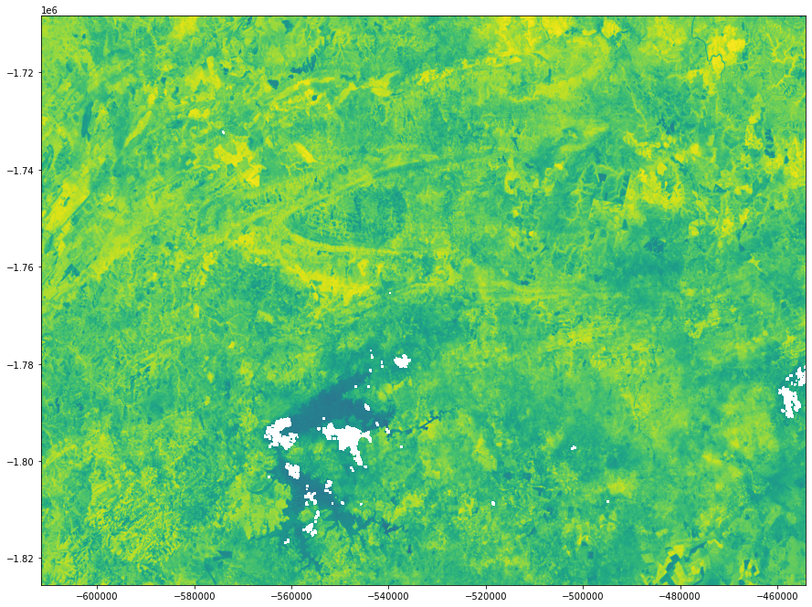

# Python Convolutional Neural Networks

[](https://docs.conda.io/en/latest/miniconda.html)
[](https://www.python.org/)
[](https://www.tensorflow.org/)
[](https://jupyter.org/)

<p align = "center">
  <iframe width="560" height="315" src="https://www.youtube.com/embed/sMWTXzVSrQI" frameborder="0" allow="accelerometer; autoplay; encrypted-media; gyroscope; picture-in-picture" allowfullscreen></iframe>
</p>

O sistema deve reconhecer áreas de talhões (unidade mínima de cultivo de uma propriedade) em um mapa, utilizando dados multitemporais, através de inteligência artificial, a interface gráfica (Web GIS), deve permitir ao usuário selecionar um intervalo de tempo e as imagens de um catálogo disponível para a região selecionada, carregando-as em bloco para não sobrecarregar o sistema e ter opção para download.

Web GIS (Web Geographic Information System): Portal de um “Sistema de Informação Geográfica” (SIG), baseado em padrão de serviços web OGC, fornecendo uma estrutura para visualização e navegação de mapas (basemaps) e de dados geográficos vetoriais e matriciais.

- Catálogo de Imagem: O Catálogo de Imagem deve possibilitar a catalogação de coleções de dados espaço-temporal, (metadados) dos satélites Landsat 8 e Sentinel-2. Obs: O catálogo de imagem também deverá fornecer interface (web API) que permitirá consultar e recuperar as cenas de satélite catalogadas. Esta interface possibilitará que o Web GIS realize pesquisas complexas, filtrando diferentes parâmetros e especificando critérios geográficos.

- Map Tile Engine: Esse componente deve produzir “map raster tile” para uma determinada cena de satélite, obedecendo ao padrão OGC WMTS. Permitindo que
usuários do Web GIS visualizem e naveguem pelas imagens sem precisar baixá-las (real time streaming). Cada map tile é uma representação visual de parte da imagem, não dos dados em si. Esses tiles geralmente são renderizados em formato pictórico (PNG ou JPEG) que podem ser exibidos em uma aplicação web.

- Download: Após a consulta às imagens de uma determinada área de interesse, o sistema permite o download de todas as cenas (com todas as suas bandas) do período selecionado pelo usuário (Pilha de imagem).

- Máscara (Mask): Neste módulo, o sistema gerará uma máscara binária com as regiões de interesse (AOI’s) para cada cena selecionada. A construção das máscaras de saída das áreas de interesse, se dão apresentando valor igual a um (1) dentro desse poligono, enquanto as demais áreas (áreas não selecionadas) apresentam valor igual a zero (0).


<p align = "center">
  
</p>

- Arquivo: Após a geração da máscara para cada cena (scene), é preciso armazená-la tanto para validação visual quanto para download. Com isso, nesse módulo a máscara deve ser armazenada de alguma forma que possibilite ao usuário fazer sua validação visual (próxima etapa), assim como o download para treinamento de modelos de inteligência artificial.

> Funcionamento das redes neurais convolucionais para o processamento das imagens.

**Obs.:** Instalação do Miniconda é necessária para a execução dos comandos a seguir.

## Ambiente de Desenvolvimento

```
# Montar no ambiente Linux
$ sudo apt-get update
$ sudo apt-get install python-numpy gdal-bin libgdal-dev

# Crie um novo ambiente conda com Python3+
$ conda create --name python-cnn python=3.6.9

# Ativar o ambiente
$ conda activate python-cnn

# Com o ambiente ativado instalar o ipykernel
(python-cnn) $ conda install notebook ipykernel

# Com o ipykernel criar um kernel com o python 3.5 automático
(python-cnn) $ ipython kernel install --user --name python-cnn

# Instalar o servidor Jupyter Lab
(python-cnn) $ python -m pip install jupyter

# Instalar a biblioteca gdal e basemap para processar as imagens
(python-cnn) $ conda install -c conda-forge gdal=2.4.4 decartes

# Executar o servidor em modo de desenvolvimento
(python-cnn) $ jupyter notebook
```

> **Obs.:** Pode ser que o Notebook não  reconheça o kernel instalado pelo conda, sendo assim você pode alterar manualmente `kernel >> Change Kernel >> python-cnn`.

## Ambiente de micro serviços em docker

```
# Construir a imagem Docker
$ docker build -t jupyter-python-cnn .

# Executar a imagem
$ docker run --name jupyter-python-cnn-docker -p 8890:8888 -d jupyter-python-cnn
```

## Código fonte

> Também será necessário acesso ao servidores FTP:

- [Sentinel-1 Data](http://www.dpi.inpe.br/agricultural-database/lem/dados/cenas/Sentinel1);

- [Sentinel-2 Data](http://www.dpi.inpe.br/obt/agricultural-database/lem/dados/cenas/Sentinel2);

- [Landsat-8 Data](http://www.dpi.inpe.br/obt/agricultural-database/lem/dados/cenas/Landsat8);

> Para a execução do código fonte abaixo é necessário o download da pasta [`data/`](https://fatecspgov-my.sharepoint.com/:u:/g/personal/abner_anjos_fatec_sp_gov_br/EaRDNhpRDGJMmSXc-AtoTDgBkG3G5tGBPvsdJBkeEOMSNw?e=fzM3V9), após o download descompacte na pasta root do projeto.


```
data/
    |_ input/
        |_ train/
            |_ false/
            |_ true/
        |_ validation/
            |_ br_uf/
            |_ false/
            |_ LEM_shapes/
            |_ true/
    |_ output/
```


```python
# !pip install tensorflow numpy matplotlib pillow wget rasterio geopandas xarray keras
```

### Importação das bibliotecas

Importando as bibliotecas necessárias para a criação do modelo utilizando o _tensorflow_ e o _keras_.


```python
import os
```


```python
import tensorflow as tf
```


```python
from tensorflow.keras.models import Sequential
from tensorflow.keras.layers import Dense, Conv2D, Flatten, Dropout, MaxPooling2D
from tensorflow.keras.preprocessing import image
from tensorflow.keras.preprocessing.image import ImageDataGenerator

import numpy as np
import matplotlib.pyplot as plt
import matplotlib.image as mpimg
```


```python
# Abstração das buscas por polígonos e georasters
from services.georasters import Georaster
from services.vector import Vector
```

### Recuperação de imagens

Utilizando a abstração criada [_Georaster_](https://github.com/ProjetoIntegradorADSFatec/python-cnn/blob/master/services/georasters.py) para recuperar imagens de sensoriamento remoto do servidor _FTP_ do INPE com o Sentinel-1.

Identificando as principais propriedades das imagens e conhecendo os dados antes do pocessamento.


```python
data = Georaster('2017-06-12 08h:35m:46s','vh', 4326)
```


```python
data.openRemoteFile()
```


```python
data.projection
```


```python
data.downloadRemoteFile()
```


```python
data.convertFileToJPG()
```


```python
data.georaster.read(1)
```


```python
for coords in data.geom.get('coordinates'):
    for coord in coords:
        print(data.georaster.read(1)[int(coord[1])][int(coord[0])])
```


```python
shapes = Vector(4326)
```


```python
data.geom
```


```python
data_geom = shapes.shape(data.geom.get('coordinates')[0])
data_geom
```


```python
data.geom
```


```python
shapes.lem.head(5)
```


<div>
<style scoped>
    .dataframe tbody tr th:only-of-type {
        vertical-align: middle;
    }

    .dataframe tbody tr th {
        vertical-align: top;
    }

    .dataframe thead th {
        text-align: right;
    }
</style>
<table border="1" class="dataframe">
  <thead>
    <tr style="text-align: right;">
      <th></th>
      <th>NM_MUNICIP</th>
      <th>CD_GEOCMU</th>
      <th>geometry</th>
    </tr>
  </thead>
  <tbody>
    <tr>
      <th>0</th>
      <td>LUÍS EDUARDO MAGALHÃES</td>
      <td>2919553</td>
      <td>POLYGON ((-45.71038 -12.39706, -45.71422 -12.3...</td>
    </tr>
  </tbody>
</table>
</div>


```python
shapes.covers.head(5)
```


<div>
<style scoped>
    .dataframe tbody tr th:only-of-type {
        vertical-align: middle;
    }

    .dataframe tbody tr th {
        vertical-align: top;
    }

    .dataframe thead th {
        text-align: right;
    }
</style>
<table border="1" class="dataframe">
  <thead>
    <tr style="text-align: right;">
      <th></th>
      <th>Id</th>
      <th>area_ha</th>
      <th>Jun_2017</th>
      <th>Jul_2017</th>
      <th>Aug_2017</th>
      <th>Sep_2017</th>
      <th>Oct_2017</th>
      <th>Nov_2017</th>
      <th>Dec_2017</th>
      <th>Jan_2018</th>
      <th>Feb_2018</th>
      <th>Mar_2018</th>
      <th>Apr_2018</th>
      <th>May_2018</th>
      <th>Jun_2018</th>
      <th>Geral</th>
      <th>variacao</th>
      <th>var</th>
      <th>geometry</th>
    </tr>
  </thead>
  <tbody>
    <tr>
      <th>0</th>
      <td>1</td>
      <td>341.632515</td>
      <td>uncultivated soil</td>
      <td>uncultivated soil</td>
      <td>uncultivated soil</td>
      <td>uncultivated soil</td>
      <td>uncultivated soil</td>
      <td>uncultivated soil</td>
      <td>uncultivated soil</td>
      <td>soybean</td>
      <td>soybean</td>
      <td>soybean</td>
      <td>uncultivated soil</td>
      <td>uncultivated soil</td>
      <td>uncultivated soil</td>
      <td>xxxxxxxsssxxx</td>
      <td>xsx</td>
      <td>s</td>
      <td>POLYGON ((391870.392 8678209.011, 390327.395 8...</td>
    </tr>
    <tr>
      <th>1</th>
      <td>523</td>
      <td>148.290258</td>
      <td>millet</td>
      <td>millet</td>
      <td>uncultivated soil</td>
      <td>uncultivated soil</td>
      <td>uncultivated soil</td>
      <td>not identified</td>
      <td>uncultivated soil</td>
      <td>not identified</td>
      <td>not identified</td>
      <td>uncultivated soil</td>
      <td>millet</td>
      <td>millet</td>
      <td>uncultivated soil</td>
      <td>llxxx-x--xllx</td>
      <td>lxlx</td>
      <td>ll</td>
      <td>POLYGON ((362953.448 8648254.537, 362492.885 8...</td>
    </tr>
    <tr>
      <th>2</th>
      <td>3</td>
      <td>196.784309</td>
      <td>uncultivated soil</td>
      <td>uncultivated soil</td>
      <td>uncultivated soil</td>
      <td>uncultivated soil</td>
      <td>uncultivated soil</td>
      <td>uncultivated soil</td>
      <td>uncultivated soil</td>
      <td>soybean</td>
      <td>soybean</td>
      <td>soybean</td>
      <td>uncultivated soil</td>
      <td>uncultivated soil</td>
      <td>uncultivated soil</td>
      <td>xxxxxxxsssxxx</td>
      <td>xsx</td>
      <td>s</td>
      <td>POLYGON ((394667.970 8677930.309, 394381.632 8...</td>
    </tr>
    <tr>
      <th>3</th>
      <td>524</td>
      <td>28.625248</td>
      <td>sorghum</td>
      <td>sorghum</td>
      <td>sorghum</td>
      <td>uncultivated soil</td>
      <td>uncultivated soil</td>
      <td>uncultivated soil</td>
      <td>uncultivated soil</td>
      <td>soybean</td>
      <td>soybean</td>
      <td>soybean</td>
      <td>uncultivated soil</td>
      <td>uncultivated soil</td>
      <td>uncultivated soil</td>
      <td>zzzxxxxsssxxx</td>
      <td>zxsx</td>
      <td>zs</td>
      <td>POLYGON ((378784.772 8650768.854, 378340.528 8...</td>
    </tr>
    <tr>
      <th>4</th>
      <td>6</td>
      <td>369.452478</td>
      <td>uncultivated soil</td>
      <td>uncultivated soil</td>
      <td>uncultivated soil</td>
      <td>uncultivated soil</td>
      <td>uncultivated soil</td>
      <td>uncultivated soil</td>
      <td>uncultivated soil</td>
      <td>uncultivated soil</td>
      <td>soybean</td>
      <td>soybean</td>
      <td>uncultivated soil</td>
      <td>uncultivated soil</td>
      <td>uncultivated soil</td>
      <td>xxxxxxxxssxxx</td>
      <td>xsx</td>
      <td>s</td>
      <td>POLYGON ((398795.097 8680743.662, 398796.144 8...</td>
    </tr>
  </tbody>
</table>
</div>


### Visualizando os dados

Visualizando os dados de entrada para a identificação dos talhões em uma imagen georreferenciada.


```python
shapes.lem.plot(color = 'black', edgecolor = 'black', figsize = (8, 8))
```


    <matplotlib.axes._subplots.AxesSubplot at 0x7f5f6b4f97b8>


<p align = "center">
  
</p>


```python
shapes.covers.plot(color = 'white', edgecolor = 'black', figsize = (8, 8))
```


    <matplotlib.axes._subplots.AxesSubplot at 0x7f5eee6a9ef0>


<p align = "center">
  
</p>

### Convertendo as imagens

Convertendo as imagens em um formato _jpg_ para ser consumido pelo treinamento do modelo.


```python
!ls -l data/input/train/true
```


```python
for i in range(11):
    if data.convertAnyFileToJPG("data/input/train/true/image{}".format(i + 1)):
        print("Converted Image {}".format(i + 1))
```


```python
!ls -l data/input/train/false
```


```python
for i in range(14):
    if data.convertAnyFileToJPG("data/input/train/false/image{}".format(i + 1)):
        print("Converted Image {}".format(i + 1))
```


```python
!ls -Rl data/input/train
```


```python
!ls -l data/input/validation/true
```


```python
for i in range(9):
    if data.convertAnyFileToJPG("data/input/validation/true/image{}".format(i + 1)):
        print("Converted Image {}".format(i + 1))
```


```python
!ls -l data/input/validation/false
```


```python
for i in range(14):
    if data.convertAnyFileToJPG("data/input/validation/false/image{}".format(i + 1)):
        print("Converted Image {}".format(i + 1))
```


```python
PATH = "data/input"
```

### Iniciando as variáveis para a criação do modelo

Iniciando as variáveis para a identificação dos dados de treinamento e validação.


```python
train_dir = os.path.join(PATH, 'train')
validation_dir = os.path.join(PATH, 'validation')
```


```python
train_false_dir = os.path.join(train_dir, 'false')
train_true_dir = os.path.join(train_dir, 'true')
validation_false_dir = os.path.join(validation_dir, 'false')
validation_true_dir = os.path.join(validation_dir, 'true')
```


```python
num_false_tr = len(os.listdir(train_false_dir))
num_true_tr = len(os.listdir(train_true_dir))

num_false_val = len(os.listdir(validation_false_dir))
num_true_val = len(os.listdir(validation_true_dir))

total_train = num_false_tr + num_true_tr
total_val = num_false_val + num_true_val
```

Entendendo os dados e calculando os items da base de dados.


```python
print('total training false images:', num_false_tr)
print('total training true images:', num_true_tr)

print('total validation false images:', num_false_val)
print('total validation true images:', num_true_val)
print("--")
print("Total training images:", total_train)
print("Total validation images:", total_val)
```

    total training false images: 42
    total training true images: 33
    total validation false images: 42
    total validation true images: 27
    --
    Total training images: 75
    Total validation images: 69


```python
batch_size = 10
epochs = 4
IMG_HEIGHT = 150
IMG_WIDTH = 150
```


```python
# Generator for our training data
train_image_generator = ImageDataGenerator(
    rescale=1./255,
    horizontal_flip=True,  # Inverte a imagem
    zoom_range=0.4,  # Aplica zoom
    rotation_range=45,  # Rotaciona
    width_shift_range=.1,  # Estica horizontalmente a imagem
    height_shift_range=.11,  # Estica verticalmente a imagem
)
# Vale ressaltar que estas modificações nas imagens ocorrem durante as epochs
# e ajudam a evitar que o modelo tenha sido treinado com duas imagens iguais
# Então, teoricamente possuímos mais imagens de teste

# Generator for our validation data
validation_image_generator = ImageDataGenerator(rescale=1./255)
```


```python
train_data_gen = train_image_generator.flow_from_directory(
    batch_size=batch_size,
    directory=train_dir,
    shuffle=True,
    target_size=(IMG_HEIGHT, IMG_WIDTH),
    class_mode='binary'
)
```

    Found 50 images belonging to 2 classes.


```python
val_data_gen = validation_image_generator.flow_from_directory(
    batch_size=batch_size,
    directory=validation_dir,
    target_size=(IMG_HEIGHT, IMG_WIDTH),
    class_mode='binary'
)
```

    Found 46 images belonging to 4 classes.


```python
sample_training_images, _ = next(train_data_gen)
```


```python
# This function will plot images in the form of
# a grid with 1 row and 5 columns where images are placed in each column.
def plotImages(images_arr):
    fig, axes = plt.subplots(1, 5, figsize=(20,20))
    axes = axes.flatten()
    for img, ax in zip( images_arr, axes):
        ax.imshow(img)
        ax.axis('off')
    plt.tight_layout()
    plt.show()
```


```python
plotImages(sample_training_images[:5])
```

<p align = "center">
  
</p>


```python
model = Sequential([
    Conv2D(16, 3, padding='same', activation='relu', input_shape=(IMG_HEIGHT, IMG_WIDTH, 3)),
    MaxPooling2D(),
    Dropout(0.2),
    Conv2D(32, 3, padding='same', activation='relu'),
    MaxPooling2D(),
    Dropout(0.1),
    Conv2D(64, 3, padding='same', activation='relu'),
    MaxPooling2D(),
    Dropout(0.1),
    Flatten(),
    Dense(512, activation='relu'),
    Dense(1)
])
```


```python
model.compile(
    optimizer='adam',
    loss=tf.keras.losses.BinaryCrossentropy(from_logits=True),
    metrics=['accuracy']
)
```


```python
model.summary()
```

    Model: "sequential"
    _________________________________________________________________
    Layer (type)                 Output Shape              Param #
    =================================================================
    conv2d (Conv2D)              (None, 150, 150, 16)      448
    _________________________________________________________________
    max_pooling2d (MaxPooling2D) (None, 75, 75, 16)        0
    _________________________________________________________________
    dropout (Dropout)            (None, 75, 75, 16)        0
    _________________________________________________________________
    conv2d_1 (Conv2D)            (None, 75, 75, 32)        4640
    _________________________________________________________________
    max_pooling2d_1 (MaxPooling2 (None, 37, 37, 32)        0
    _________________________________________________________________
    dropout_1 (Dropout)          (None, 37, 37, 32)        0
    _________________________________________________________________
    conv2d_2 (Conv2D)            (None, 37, 37, 64)        18496
    _________________________________________________________________
    max_pooling2d_2 (MaxPooling2 (None, 18, 18, 64)        0
    _________________________________________________________________
    dropout_2 (Dropout)          (None, 18, 18, 64)        0
    _________________________________________________________________
    flatten (Flatten)            (None, 20736)             0
    _________________________________________________________________
    dense (Dense)                (None, 512)               10617344
    _________________________________________________________________
    dense_1 (Dense)              (None, 1)                 513
    =================================================================
    Total params: 10,641,441
    Trainable params: 10,641,441
    Non-trainable params: 0
    _________________________________________________________________


```python
history = model.fit_generator(
    train_data_gen,
    steps_per_epoch=3,  # total_train
    epochs=epochs,
    validation_data=val_data_gen,
    validation_steps=total_val // batch_size
)
```

    WARNING:tensorflow:From <ipython-input-41-2eb3b68c85c4>:6: Model.fit_generator (from tensorflow.python.keras.engine.training) is deprecated and will be removed in a future version.
    Instructions for updating:
    Please use Model.fit, which supports generators.
    Epoch 1/4
    3/3 [==============================] - 247s 82s/step - loss: 1.5138 - accuracy: 0.5333 - val_loss: -2.7784 - val_accuracy: 0.0000e+00
    Epoch 2/4
    3/3 [==============================] - 292s 97s/step - loss: 2.1543 - accuracy: 0.2000 - val_loss: 0.2031 - val_accuracy: 0.0000e+00
    Epoch 3/4
    3/3 [==============================] - 149s 50s/step - loss: 0.7297 - accuracy: 0.4667 - val_loss: 0.8846 - val_accuracy: 0.0000e+00
    Epoch 4/4
    3/3 [==============================] - 161s 54s/step - loss: 0.6469 - accuracy: 0.5000 - val_loss: 1.0150 - val_accuracy: 0.0000e+00


```python
acc = history.history['accuracy']
val_acc = history.history['val_accuracy']
loss=history.history['loss']
val_loss=history.history['val_loss']

```


```python
epochs_range = range(epochs)
```


```python
plt.figure(figsize=(8, 8))
plt.subplot(1, 2, 1)
plt.plot(epochs_range, acc, label='Training Accuracy')
plt.plot(epochs_range, val_acc, label='Validation Accuracy')
plt.legend(loc='lower right')
plt.title('Training and Validation Accuracy')

```


    Text(0.5, 1.0, 'Training and Validation Accuracy')


<p align = "left">
  
</p>


```python
plt.subplot(1, 2, 2)
plt.plot(epochs_range, loss, label='Training Loss')
plt.plot(epochs_range, val_loss, label='Validation Loss')
plt.legend(loc='upper right')
plt.title('Training and Validation Loss')
plt.show()
```

<p align = "left">
  
</p>

### Iniciando os testes com o modelo

Testes com o modelo criado anteriormente para a identificação de talhões.


```python
teste = image.load_img('data/input/validation/true/image9.jpg', target_size=(IMG_HEIGHT, IMG_WIDTH))
teste = image.img_to_array(teste)
teste = np.expand_dims(teste, axis=0)
resultado = model.predict(teste)
plt.imshow(mpimg.imread('data/input/validation/true/image9.jpg'))
```


    <matplotlib.image.AxesImage at 0x7f5f693a8e10>


<p align = "center">
  
</p>


```python
'Sim' if resultado[0][0] == 1 else 'Não'
```


    'Não'


```python
train_data_gen.class_indices
```


    {'false': 0, 'true': 1}


```python
lem = rasterio.open('data/input/validation/true/image9.tif')
```


```python
shp = gp.read_file('data/output/LEM_2017_2018_mensal_training.shp')
```


```python
fig, ax = pyplot.subplots(figsize=(10,10))
rasterio.plot.show(lem,ax=ax)
shp.plot(ax=ax,facecolor="white", edgecolor="black")
```


    <matplotlib.axes._subplots.AxesSubplot at 0x7f06d7b42ba8>


<p align = "center">
  
</p>

### Image Processing Examples
Using RasterIO and RasterStats to processing images from STAC service.

#### Install Requirements
Import require libraries to image processing


```python
!pip install rasterio rasterstats geopandas numpy
```

To retrieve image metadata, we need the [STAC abstraction](https://github.com/brazil-data-cube/bdc-stac) for [STAC Client Python](https://github.com/brazil-data-cube/stac.py). This is an implementation of the [SpatioTemporal Asset Catalog specification](https://github.com/radiantearth/stac-spec) for the Brazil Data Cube image and data cube collections


```python
!pip install git+git://github.com/brazil-data-cube/stac.py@b-0.8.0#egg=stac
```

#### Import Requirements


```python
import geopandas as gp
import rasterio.plot
import rasterio
import rasterstats
import fiona as f
import numpy as np
from matplotlib import pyplot
from pprint import pprint
from stac import STAC
from rasterstats import zonal_stats, point_query
```

#### Selecting images
First we will select some images from STAC Service using the [STAC Client guide](https://github.com/brazil-data-cube/stac.py/blob/master/examples/stac.ipynb) for Python users. After create an client for STAC we will retrieve some metadata to understanding the images.


```python
stac_client = STAC('http://brazildatacube.dpi.inpe.br/bdc-stac/0.8.0/')
```


```python
collection = stac_client.collection('C4_64_16D_MED')
```


```python
items = collection.get_items()
```

Downloading the images and saving the local address for later use.


```python
red = items.features[0].assets['red'].download()
green = items.features[0].assets['green'].download()
blue = items.features[0].assets['blue'].download()
ndvi = items.features[0].assets['ndvi'].download()
```

Understanding the image values using rasterio, opening and reading band number 1.


```python
rasterio.open(ndvi).read(1)
```


    array([[7821, 7800, 7794, ..., 5711, 6363, 6609],
           [7817, 7815, 7780, ..., 5665, 6240, 6640],
           [7876, 7875, 7859, ..., 5845, 6188, 6626],
           ...,
           [6053, 5820, 6431, ..., 6565, 6579, 6655],
           [6725, 6795, 7390, ..., 6296, 6240, 6371],
           [7061, 7568, 7864, ..., 6240, 6049, 6202]], dtype=int16)


```python
ndvi
```


    'C4_64_16D_MED_083100_2019-12-19_2019-12-31_ndvi.tif'


```python
r = rasterio.open(red).read(1)
g = rasterio.open(green).read(1)
b = rasterio.open(blue).read(1)
vi = rasterio.open(ndvi)
```


```python
r.max()
```


    4369


#### Opening Images
After understanding the images metadata we will open the first image for NDVI and retrieve geometry to later use.


```python
def normalize(array):
    """Normalizes numpy arrays into scale 0.0 - 1.0"""
    array_min, array_max = array.min(), array.max()
    return ((array - array_min)/(array_max - array_min))
```


```python
rgb = np.dstack((normalize(r), normalize(g), normalize(b)))
pyplot.imshow(rgb)
```


    <matplotlib.image.AxesImage at 0x7f5ee8214be0>


<p align = "center">
  
</p>

We need to convert the input data to native CRS image. Now using Shapefile.


```python
shp = gp.read_file('data/output/LEM_2017_2018_mensal_training.shp')
```


```python
shp.crs = vi.crs.to_dict()
shp = shp.to_crs("EPSG:4326")
```

Ploting image normalized to see the RGB image.


```python
fig, ax = pyplot.subplots(figsize=(15,15))
rasterio.plot.show(vi,ax=ax)
shp.plot(ax=ax,facecolor="green", edgecolor="black")
```


    <matplotlib.axes._subplots.AxesSubplot at 0x7f5ec063e240>


<p align = "center">
  
</p>
